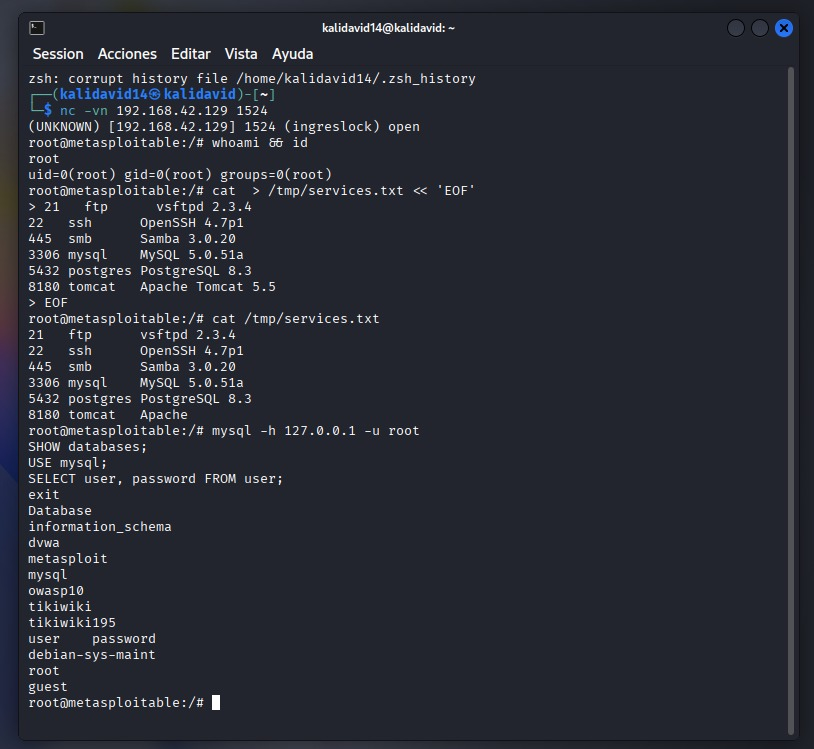
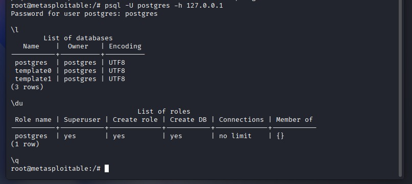
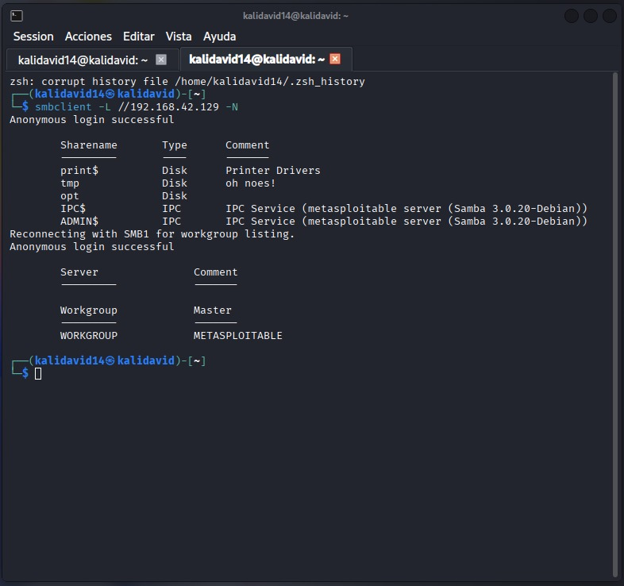

# DAY 3 – Horizontal Movement & First Tool
**Date:** 2025-12-11  
**Target:** 192.168.42.129  
**Author:** davidperlaza14  

## 1. OBJECTIVE
Demonstrate access to multiple services without credentials.

## 2. RESULTS
| Service | Access | Evidence |
|---------|--------|----------|
| MySQL   | ✅ root | screenshot mysql> |
| PostgreSQL | ✅ postgres | screenshot psql> |
| Samba   | ✅ shares listed | screenshot smbclient |

## 3. TOOL CREATED
**ownit_day3.sh** – automatic checker for MySQL, PostgreSQL and Samba anonymous shares.  
Location: `tools/ownit_day3.sh`

## 4. MITRE ATT&CK
- T1110 – Brute Force (MySQL/PostgreSQL null passwords)  
- T1135 – Network Share Discovery (Samba)

## 5. REMEDIATIONS
- Set strong passwords for MySQL/PostgreSQL root accounts  
- Disable anonymous Samba shares  
- Enable host-based authentication

## 6. EVIDENCIAS VISUALES

### MySQL – acceso root

### PostgreSQL – acceso postgres

### Samba – shares anónimas

